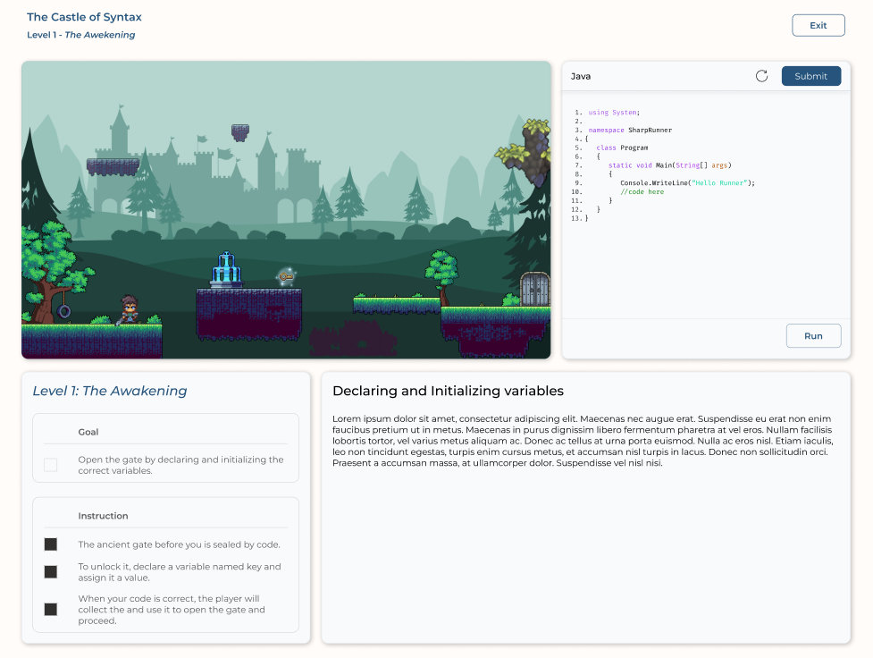

# SharpRunner

_A gamified learning platform for mastering C# fundamentals._

SharpRunner is a full-stack web application that helps beginner programmers learn C# through short lessons, classroom-guided progress, and a 2D platformer-style coding game. Students write small C# snippets in an embedded editor, submit their solution, and see the level react through game animations and progress updates.

## Project Goal

SharpRunner aims to make introductory programming less intimidating by turning core C# concepts into guided, playable activities. The app supports students, teachers, admins, and a developer-only admin invite flow.

## Current Status

- The backend progress model supports 4 lessons with 10 levels each, for 40 total progress rows per student.
- The playable game currently exposes Lesson 1 levels 1-5.
- Student progress, attempts, time spent, final score, and grade label are saved through the backend.
- Teachers can manage classrooms, view student progress, post announcements, and edit per-classroom level content overrides.
- Admins can manage users, create teacher accounts, and view admin activity logs.
- Developer tools can generate one-time admin invite codes.

## Features

### Student Experience

- Register or log in with email/username and password.
- Sign in with Google when configured.
- Join a classroom using a teacher-provided class code.
- Access the dashboard, lesson map, playable levels, leaderboard, announcements, and saved grades.
- Complete coding challenges through a Monaco-based C# editor.
- Receive a saved final score and grade after level completion.

### Teacher Experience

- Create classrooms with generated class codes.
- View dashboard metrics for students, classrooms, average progress, and active gameplay.
- Manage class rosters and view student performance.
- Post classroom announcements.
- View per-student level scores, attempts, and time spent.
- Edit per-classroom level content such as lesson text, goals, instructions, starter code, and validator settings.

### Admin Experience

- View and search users.
- Create teacher accounts.
- Activate or deactivate non-admin users.
- View admin activity logs.
- Bootstrap the first admin through a setup key, or create admins through developer-generated invite codes.

### Game And Learning

- Level-driven architecture using configs, validators, and Phaser scenes.
- Current lesson focus: Variables and Data Types.
- Implemented validator types include single integer declarations, exact goal declarations, and multiple string declarations.
- Future lessons are planned for Operators, Conditional Statements, and Loops.

## Tech Stack

### Frontend

- React 19
- Vite
- React Router
- Phaser
- Monaco Editor
- Axios
- CSS Modules
- MUI / React Icons

### Backend

- Node.js
- Express
- Sequelize
- PostgreSQL
- JWT authentication
- Passport Google OAuth

## Project Structure

```text
backend/
  src/
    app.js
    server.js
    config/
    constants/
    data/
    middleware/
    models/
    routes/
    services/

frontend/
  src/
    App.jsx
    Components/
    pages/
      admin/
      auth/
      developer/
      game/
      map/
      student/
      teacher/
    utils/
  public/
    game/
```

## Local Setup

Install dependencies:

```bash
npm --prefix backend install
npm --prefix frontend install
```

Create `backend/.env` with the required database and auth settings:

```env
DB_NAME=your_database
DB_USER=your_user
DB_PASSWORD=your_password
DB_HOST=localhost
DB_PORT=5432
JWT_SECRET=your_jwt_secret
FRONTEND_URL=http://localhost:5173
FRONTEND_URLS=http://localhost:5173,http://127.0.0.1:5173
BACKEND_URL=http://localhost:5000
ADMIN_SETUP_KEY=your_admin_setup_key
DEVELOPER_SETUP_KEY=your_developer_setup_key
```

For local frontend development, `frontend/.env.development` points to
`http://localhost:5000`. Production still uses `frontend/.env.production`, which
points to the Railway backend.

Optional Google OAuth settings:

```env
GOOGLE_CLIENT_ID=your_google_client_id
GOOGLE_CLIENT_SECRET=your_google_client_secret
```

Run the backend:

```bash
npm --prefix backend run dev
```

Run the frontend:

```bash
npm --prefix frontend run dev:local
```

Build the frontend:

```bash
npm --prefix frontend run build
```

## Important Routes

### Frontend

- `/` - landing page
- `/login` - login
- `/signup` - student registration
- `/dashboard` - student dashboard
- `/join-class` - student class join
- `/Map` - lesson map
- `/Map/level/:levelNumber` - playable level route
- `/teacher` - teacher dashboard
- `/teacher/classes` - teacher classes
- `/teacher/students` - teacher student progress
- `/teacher/analytics` - teacher analytics
- `/teacher/announcements` - teacher announcements
- `/teacher/classrooms/:classroomId/levels` - teacher level editor
- `/admin` - admin dashboard
- `/developer` - developer admin-invite tools
- `/admin-invite` - admin invite registration

### Backend

- `/api/auth`
- `/api/progress`
- `/api/lesson-content`
- `/api/admin`
- `/api/teacher`
- `/api/classrooms`
- `/api/notifications`
- `/api/developer`

## Current Priorities

1. Finish Lesson 1 levels 6-10 so the first lesson becomes a complete playable module.
2. Keep backend grading as the single source of truth for scores shown in the game, map, dashboard, and teacher pages.
3. Add a small manual QA checklist for demo preparation.
4. Add automated tests for auth, progress saving, class joining, and teacher/admin APIs.
5. Consider frontend code-splitting because the production bundle is currently large.

## Developer

SharpRunner is developed by Andrei Jay Amoroto.

## Preview


