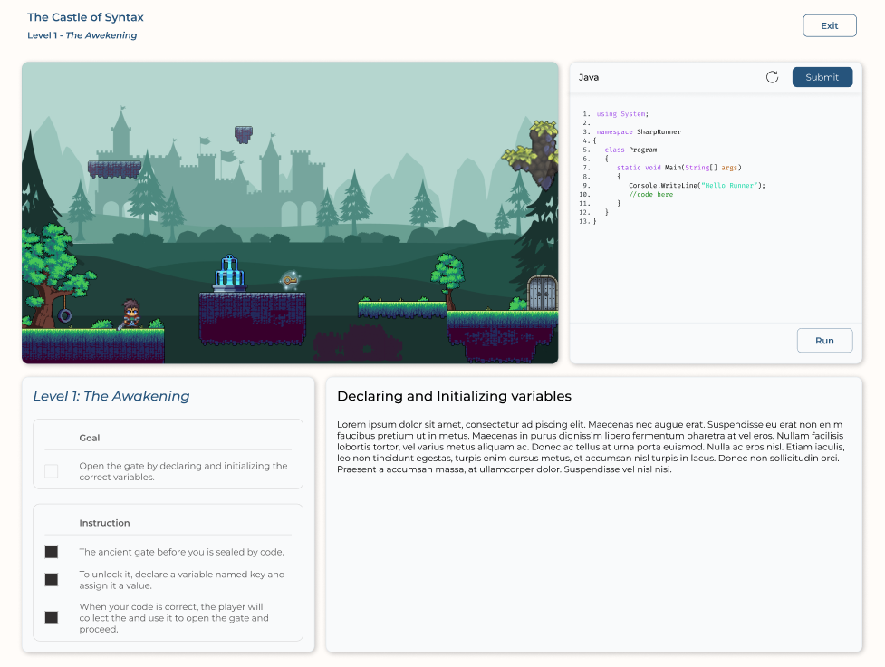

# SharpRunner

_A gamified learning platform for mastering C# fundamentals._

SharpRunner is a full-stack web application that helps beginner programmers learn C# through short lessons, classroom-guided progress, and a 2D platformer-style coding game. Students write small C# snippets in an embedded editor, submit their solution, and see the level react through game animations and progress updates.

## Project Goal

SharpRunner aims to make introductory programming less intimidating by turning core C# concepts into guided, playable activities. The app supports students, teachers, admins, and a developer-only admin invite flow.

## Current Status

- The backend curriculum contains 30 progress rows: tutorial, Arrays, Functions/Methods, Functions with Arrays, and the final challenge.
- The playable game exposes 29 routes covering levels 1–30 (the combined Functions scene covers curriculum levels 24–25).
- Student progress, attempts, time spent, final score, and grade label are saved through the backend.
- Teachers can manage classrooms, view student progress, post announcements, manage classwork, and configure the currently supported per-classroom level settings.
- Teachers can organize secure classroom modules, lessons, assignments, external links, and multimedia resources. They cannot edit Phaser levels or validators.
- Failed attempts unlock a free basic hint at the teacher-configured threshold (three by default).
- First completions award server-owned XP and bonuses separately from academic scores.
- Admins can manage users, create teacher accounts, and view admin activity logs.
- Developer tools can generate one-time admin invite codes.

## Features

### Student Experience

- Register or log in with email/username and password.
- Sign in with Google when configured.
- Join a classroom using a teacher-provided class code.
- Access the dashboard, lesson map, playable levels, leaderboard, announcements, and saved grades.
- Complete coding challenges through a Monaco-based C# editor.
- Receive a saved final score and grade after level completion.
- Earn one-time XP for first completion, first-attempt success, and no-hint success.
- Select optional motivation and learning-game preferences from the dashboard.
- Revisit available teacher content and replay completed levels without overwriting the original score or farming XP.

### Teacher Experience

- Create classrooms with generated class codes.
- View dashboard metrics for students, classrooms, average progress, and active gameplay.
- Manage class rosters and view student performance.
- Post classroom announcements.
- View per-student level scores, attempts, and time spent.
- Configure per-classroom level availability, order, unlock and due dates, hints, and grading deductions.
- Configure the hint unlock threshold from 1–10 failed attempts (default 3).
- Create instructional modules and associate lessons/assignments with optional secure attachments and external links.
- Remove students from a roster without deleting their saved progress.
- Archive/reactivate classrooms and rotate compromised class codes.
- Update teacher profile details and password from `/teacher/settings`.

### Admin Experience

- View and search users.
- Create teacher accounts.
- Activate or deactivate non-admin users.
- Change student/teacher roles with ownership safeguards.
- Email temporary-password resets to teacher accounts.
- Browse paginated users and audit activity with accurate system totals.
- Permanently delete non-admin accounts after confirmation.
- View admin activity logs.
- Bootstrap the first admin through a setup key, or create admins through developer-generated invite codes.

### Game And Learning

- Level-driven architecture using configs, validators, and Phaser scenes.
- Current lesson focus: Variables and Data Types.
- Implemented validator types include single integer declarations, exact goal declarations, and multiple string declarations.
- Future lessons are planned for Operators, Conditional Statements, and Loops.

## Tech Stack

### Frontend

- React 19
- Vite
- React Router
- Phaser
- Monaco Editor
- Axios
- CSS Modules
- MUI / React Icons

### Backend

- Node.js
- Express
- Sequelize
- PostgreSQL
- JWT authentication
- Passport Google OAuth

## Project Structure

```text
backend/
  src/
    app.js
    server.js
    config/
    constants/
    data/
    middleware/
    models/
    routes/
    services/

frontend/
  src/
    App.jsx
    Components/
    pages/
      admin/
      auth/
      developer/
      game/
      map/
      student/
      teacher/
    utils/
  public/
    game/
```

## Local Setup

Install dependencies:

```bash
npm --prefix backend install
npm --prefix frontend install
```

Create `backend/.env` with the required database and auth settings:

```env
DB_NAME=your_database
DB_USER=your_user
DB_PASSWORD=your_password
DB_HOST=localhost
DB_PORT=5432
JWT_SECRET=your_jwt_secret
FRONTEND_URL=http://localhost:5173
FRONTEND_URLS=http://localhost:5173,http://127.0.0.1:5173
BACKEND_URL=http://localhost:5000
ADMIN_SETUP_KEY=your_admin_setup_key
DEVELOPER_SETUP_KEY=your_developer_setup_key
LESSON_UPLOAD_MAX_FILES=5
LESSON_UPLOAD_MAX_MB=25
REQUIRE_FILE_SCANNING=false
```

For local frontend development, `frontend/.env.development` points to
`http://localhost:5000`. Production uses the Render API URL in
`frontend/.env.production`.

Optional Google OAuth settings:

```env
GOOGLE_CLIENT_ID=your_google_client_id
GOOGLE_CLIENT_SECRET=your_google_client_secret
```

Manual student and teacher accounts require inbox verification. Configure an
SMTP account so the backend can send the single-use verification links:

```env
SMTP_HOST=smtp.your-provider.com
SMTP_PORT=2587
SMTP_SECURE=false
SMTP_USER=your_smtp_username
SMTP_PASS=your_smtp_password
EMAIL_FROM="SharpRunner <no-reply@your-domain.com>"
```

Use `SMTP_SECURE=true` with port `465`. Render free services block standard SMTP
ports, so the example uses Resend's STARTTLS port `2587`. The sender address must
be authorized by your email provider. Verification codes and links use
`FRONTEND_URL`, expire after 30 minutes, and can be resent from `/verify-email`. Without SMTP configuration,
manual student and teacher registration returns a service-unavailable error;
Google sign-in continues to work when configured.

Run the backend:

```bash
npm --prefix backend run dev
```

Run the frontend:

```bash
npm --prefix frontend run dev:local
```

Build the frontend:

```bash
npm --prefix frontend run build
```

Apply pending database migrations without starting the API:

```bash
npm --prefix backend run db:migrate
```

Run the automated suites:

```bash
npm --prefix backend test
npm --prefix frontend test
```

Before a presentation or manual QA session, run the combined demo preflight and
then follow the role-by-role checklist in `docs/DEMO_QA_CHECKLIST.md`:

```bash
node scripts/demo-preflight.mjs
```

The backend suite starts the Express application on an ephemeral local port and
tests authentication, classroom joining, progress validation and scoring,
teacher/admin authorization, and developer invites without changing a real
database. A future database-backed suite must use a disposable database through
`TEST_DATABASE_URL`; never point it at development or production data.

Set `REQUIRE_FILE_SCANNING=true` in production only when `CLAMAV_BIN` points to
an available ClamAV executable. Executable signatures are rejected regardless
of scanner configuration.

## Supabase + Render Deployment

The backend continues to use Sequelize and connects to Supabase as a standard
PostgreSQL database. It does not need a Supabase API key.

1. Create a Supabase project near the Render region you plan to use.
2. In Supabase, open **Connect**, select the **Session pooler**, and copy its URI.
   Use session mode (port `5432`) for the persistent Render web service. Replace
   the password placeholder with the database password if necessary.
3. Commit and push this repository, then in Render choose **New > Blueprint** and
   select it. Render reads `render.yaml` and asks for:
   - `DATABASE_URL`: the Supabase Session pooler URI.
   - `FRONTEND_URL`: the exact deployed frontend origin, without a trailing slash
     (for example, `https://your-app.vercel.app`).
   The Blueprint keeps the database connection encrypted but disables Node's CA
   chain verification because the Supabase pooler presents a certificate chain
   that Render's Node runtime does not trust by default.
4. After deployment, verify
   `https://sharprunner-api-andreii2305.onrender.com/api/health`. It should return
   `{"status":"ok","database":"connected"}`. The first startup creates the
   application tables in an empty Supabase database.
5. If Render assigns a different hostname, update `frontend/.env.production` to
   that URL. Rebuild and redeploy the frontend so Vite embeds the new API URL.

For Google sign-in, add `GOOGLE_CLIENT_ID` and `GOOGLE_CLIENT_SECRET` in Render,
then register this callback URL with Google:

```text
https://YOUR-RENDER-SERVICE.onrender.com/api/auth/google/callback
```

`BACKEND_URL` is optional on Render because the app uses Render's built-in
`RENDER_EXTERNAL_URL`. Set it explicitly only when using a custom backend domain.

### Moving existing Railway data

If the old Railway PostgreSQL connection is still reachable, export and restore
it before directing users to the new backend. Supabase recommends its Session
pooler URI for PostgreSQL migrations as well:

```bash
pg_dump --dbname="OLD_RAILWAY_DATABASE_URL" --format=custom --no-owner --no-acl --file=sharprunner.dump
pg_restore --dbname="SUPABASE_SESSION_POOLER_URL" --clean --if-exists --no-owner --no-acl sharprunner.dump
```

Keep both connection strings out of Git. If the Railway database is no longer
reachable, deploy against the empty Supabase database and Sequelize will create
the current schema on startup; the old rows cannot be recovered without a dump
or provider backup.

## Important Routes

### Frontend

- `/` - landing page
- `/login` - login
- `/signup` - student registration
- `/verify-email` - manual email verification and link resend
- `/admin-verify-email` - admin-invite OTP verification
- `/dashboard` - student dashboard
- `/join-class` - student class join
- `/Map` - lesson map
- `/tutorial/level/:levelNumber` - tutorial levels 1–5
- `/array/level/:levelNumber` - array levels 1–8
- `/function/level/:levelNumber` - function levels 1–11
- `/function-with-array/level/:levelNumber` - functions-with-arrays levels 1–5
- `/Map/level/:levelNumber` - legacy global-level URL that redirects to the lesson route
- `/teacher` - teacher dashboard
- `/teacher/classes` - teacher classes
- `/teacher/students` - teacher student progress
- `/teacher/analytics` - teacher analytics
- `/teacher/announcements` - teacher announcements
- `/teacher/settings` - teacher profile and password settings
- `/teacher/classrooms/:classroomId/levels` - teacher level settings for availability, order, scheduling, hints, and grading deductions
- `/admin` - admin dashboard
- `/developer` - developer admin-invite tools
- `/admin-invite` - admin invite registration

### Backend

- `/api/auth`
- `/api/progress`
- `/api/lesson-content`
- `/api/admin`
- `/api/teacher`
- `/api/classrooms`
- `/api/notifications`
- `/api/developer`

## Current Priorities

1. Keep backend grading and XP ledgers as the sources of truth for scores and rewards.
2. Run the manual/demo QA checklist on each presentation build.
3. Expand API coverage with disposable PostgreSQL-backed migration and transaction tests.
4. Consider frontend code-splitting because the production bundle is currently large.

See `docs/PANEL_SYSTEM_RECOMMENDATIONS.md` for panel recommendation traceability and the teacher/developer architectural boundary.

## Developer

SharpRunner is developed by Andrei Jay Amoroto.

## Preview


